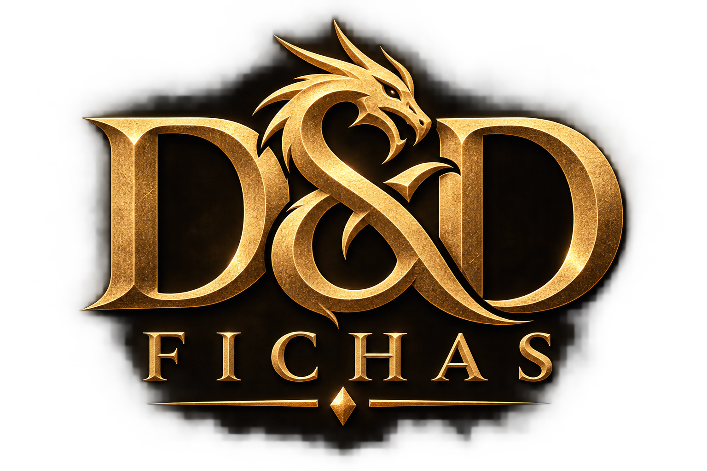

<p align="center">
  
</p>

# D&D Fichas

Aplicação local para criar, organizar e usar fichas de personagens de **Dungeons & Dragons 5e (regras de 2014/PHB)**. O projeto privilegia uma ficha útil à mesa, com dados e regras locais, sem depender de conta ou servidor.

O código da aplicação fica em [`dnd-fichas/`](./dnd-fichas), enquanto este README permanece na raiz do repositório.

## Recursos

- Criação guiada de personagem e ficha em branco.
- 9 raças, 12 classes, 8 antecedentes e 26 subclasses do catálogo atual.
- Proficiências iniciais por classe, raça e antecedente, com idiomas, ferramentas e origem de cada concessão.
- Multiclasse com pré-requisitos, nível total máximo 20, proficiências reduzidas, pools de dados de vida e PV por classe de origem.
- Assistente de level up com PV, ASI, subclasse, habilidades e troca opcional de magias.
- Magias por classe, conjuração parcial, espaços combinados, Magia de Pacto e Arcano Místico.
- Segredos Mágicos de Bardo/Colégio do Conhecimento e origens especiais por talento, item ou regra da mesa.
- Validação para a mesa: erros bloqueantes, escolhas pendentes, avisos e estado de rascunho ou ficha pronta.
- Combate, ataques, recursos, concentração, descansos, inventário, moedas e rolagens.
- Persistência automática em `localStorage`, além de importação e exportação de fichas em JSON.

## Executar localmente

```bash
cd dnd-fichas
npm install
npm run dev
```

## Comandos disponíveis

Execute os comandos dentro de `dnd-fichas/`:

```bash
npm run dev      # desenvolvimento
npm test         # testes automatizados
npm run lint     # análise estática
npm run build    # build de produção
npm run preview  # visualização do build
```

## Dados e privacidade

As fichas são armazenadas apenas no navegador atual. Use a opção de exportação em JSON para manter cópias de segurança ou transferir uma ficha entre navegadores.

## Escopo do catálogo

O projeto usa um catálogo local selecionado, não uma cópia completa de todo conteúdo publicado para D&D 5e. As opções automáticas já suportadas — subclasses, limites de magia e regras de criação — possuem os dados necessários no catálogo atual. Conteúdo manual e regras específicas de campanha continuam possíveis e são identificados como tal na ficha.
